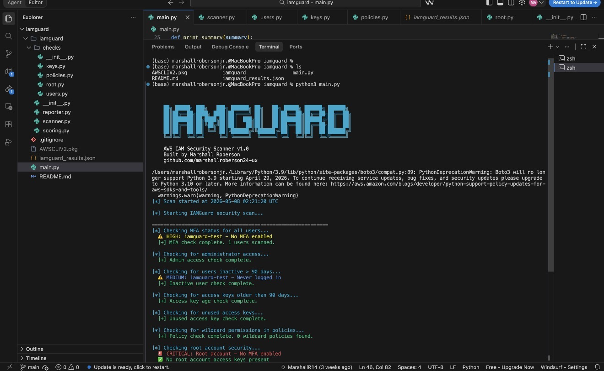
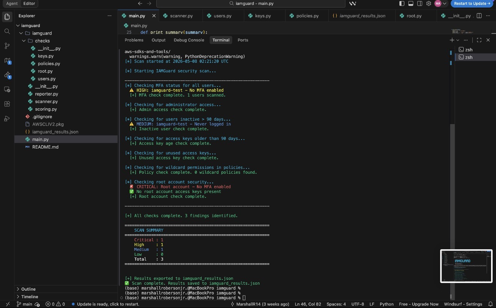
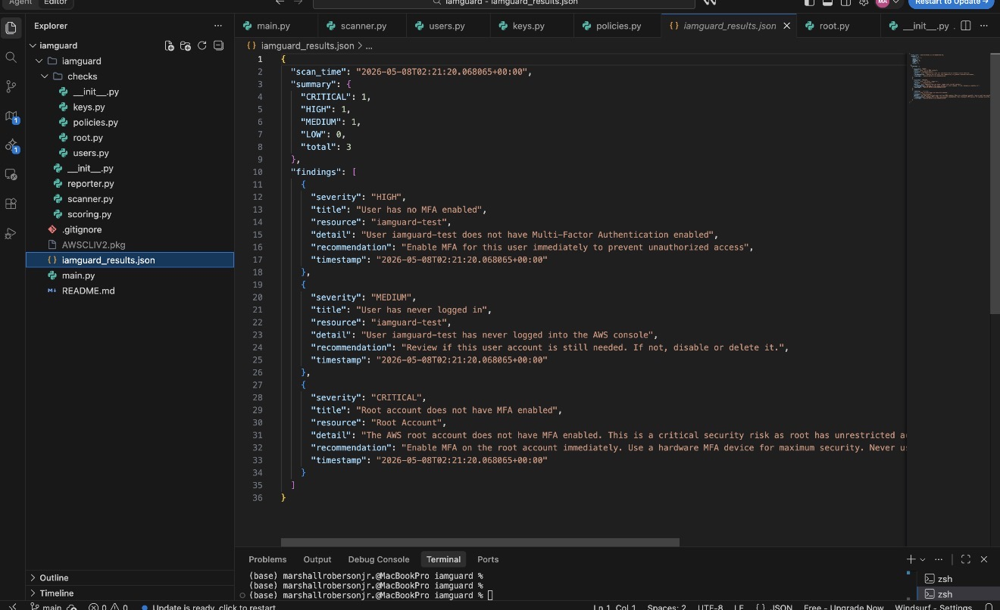

# IAMGuard 🛡️

**AWS IAM Security Scanner**

IAMGuard is an open-source Python tool that scans AWS IAM environments 
for critical misconfigurations and security risks. It identifies 
over-privileged users, missing MFA, inactive accounts, aged access keys, 
and wildcard permissions — then generates risk-scored findings with 
plain-English remediation guidance.

Built by [Marshall Roberson](https://marshallroberson24-ux.github.io)

---

## What It Scans

| Check | Severity |
|-------|----------|
| Users with no MFA enabled | HIGH |
| Users with AdministratorAccess | CRITICAL |
| Users inactive 90+ days | MEDIUM |
| Access keys older than 90 days | HIGH |
| Access keys never used | MEDIUM |
| Policies with wildcard (*) actions | CRITICAL |
| Policies with wildcard (*) resources | HIGH |
| Root account MFA disabled | CRITICAL |
| Root account access keys present | CRITICAL |

## Example Output

The following scan was run against a live AWS account and detected 3 real security findings including a critical root account vulnerability.

### IAMGuard Banner


### Live Scan Results


### Scan Summary



## Installation

```bash
git clone https://github.com/marshallroberson24-ux/iamguard
cd iamguard
pip3 install boto3 colorama
```

## Setup AWS Credentials

```bash
aws configure
```

You will need:
- AWS Access Key ID
- AWS Secret Access Key
- Default region (e.g. us-east-1)

## Usage

```bash
python3 main.py
```

## Output

- Colored terminal output with severity levels
- JSON export: `iamguard_results.json`

## Risk Levels

- 🚨 **CRITICAL** — Immediate action required
- ⚠️ **HIGH** — Address within 24 hours
- 🔷 **MEDIUM** — Address within 7 days
- 🔹 **LOW** — Address when possible

---

## Built With

- Python 3
- AWS boto3 SDK
- Windsurf IDE
- colorama

---

*IAMGuard is intended for use on AWS accounts you own or have 
explicit permission to scan.*
